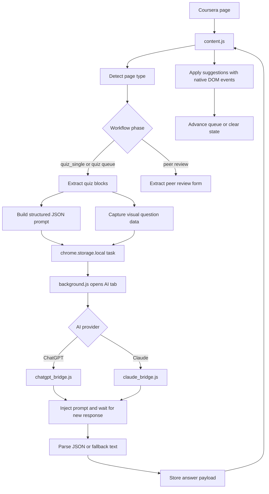

# Coursera Quiz AI Solver

<p align="center">
  <a href="https://github.com/aburahatsabir/coursera-quiz-ai-solver/releases/latest">
    
  </a>
  
  
  
  
</p>

<p align="center">
  <strong>An open-source Chrome extension that studies Coursera quiz pages, extracts question context, routes prompts through ChatGPT or Claude web sessions, and returns structured answer suggestions inside the Coursera page.</strong>
</p>

<p align="center">
  <a href="#quick-start">Quick Start</a> |
  <a href="#what-it-does">What It Does</a> |
  <a href="#architecture">Architecture</a> |
  <a href="#lifecycle">Lifecycle</a> |
  <a href="#responsible-use">Responsible Use</a> |
  <a href="#troubleshooting">Troubleshooting</a>
</p>

---

## Responsible Use

This project is documented as a browser automation and AI-assistance research tool. Use it only where automation and AI assistance are allowed: personal practice, self-review, accessibility support, private test courses, internal demos, or workflows where you have explicit permission.

Do not use this extension to misrepresent your own work, submit answers you have not reviewed, violate a course honor code, or distort peer assessment outcomes. Coursera courses and institutions may have strict academic integrity rules. You are responsible for checking those rules before using any automation.

The README intentionally avoids academic-integrity evasive positioning. That language may attract the wrong audience, reduce trust, and get the repository flagged. The stronger long-term SEO position is transparent, accurate, and responsible: "Coursera quiz AI assistant", "Coursera Chrome extension", "ChatGPT Claude bridge", "no API key learning assistant", and "open-source Coursera automation research".

---

## What It Does

Coursera Quiz AI Solver is a Manifest V3 browser extension for Chromium-based browsers. It injects a small Coursera-side toolbar, detects quiz and assignment page layouts, extracts visible question content, prepares structured prompts, sends those prompts to an active ChatGPT or Claude web tab, parses the model response, and writes answer suggestions back into the page.

The extension also includes peer assignment support. Peer review automation is treated as a feature of the same product, not the product name. The product and release artifact remain:

```text
coursera-quiz-ai-solver
coursera-quiz-ai-solver.zip
Coursera Quiz AI Solver
```

### Core Capabilities

| Area | Capability |
| --- | --- |
| Browser platform | Chrome, Edge, Brave, and other Chromium browsers that support Manifest V3 |
| AI routing | Uses active ChatGPT and Claude web sessions instead of paid API keys |
| Quiz parsing | Detects multiple-choice, multi-select, numeric, short-answer, free-text, exam, quiz, and assignment-submission layouts |
| Visual questions | Detects images, canvases, and visual question companions, then attaches captured image data to the AI prompt when possible |
| State management | Uses `chrome.storage.local` to persist queue state across Coursera single-page-app navigation |
| Fallback logic | Starts with ChatGPT, falls back to Claude on timeout, parsing failure, or retry/failed-quiz context |
| Parser design | Uses brace-balanced JSON extraction, sanitized JSON recovery, and text fallback parsing |
| Page controls | Popup buttons and an injected Coursera toolbar provide single-page and queued workflows |
| Peer feature | Finds pending peer review rows after submission is detected and can assist with review-form completion |
| Packaging | Latest release artifact is `coursera-quiz-ai-solver.zip` |

---

## Why This Exists

Modern Coursera pages are React-heavy single-page applications. A simple userscript that clicks fixed selectors usually breaks when the DOM changes, when a modal appears, when a question uses a new `data-testid`, or when a model response contains malformed JSON.

This extension explores a more resilient architecture:

1. Detect page type from URL and DOM.
2. Persist a workflow phase in extension storage.
3. Collect question blocks with multiple selector passes.
4. Build a strict JSON prompt for an AI web tab.
5. Wait for a new model response, not an old chat message.
6. Parse and sanitize responses with multiple recovery paths.
7. Apply the result back through native DOM events so React notices the change.
8. Continue the queue across navigation until the state is cleared.

That makes the repository useful for developers studying Chrome extension architecture, Coursera DOM automation, web UI AI bridges, and resilient parser design.

---

## Quick Start

### 1. Download the Latest Release

Download the latest package from:

```text
https://github.com/aburahatsabir/coursera-quiz-ai-solver/releases/latest
```

The release asset should be named:

```text
coursera-quiz-ai-solver.zip
```

Extract the zip to a normal folder before loading it into Chrome.

### 2. Load the Extension

1. Open `chrome://extensions/`.
2. Enable `Developer mode`.
3. Click `Load unpacked`.
4. Select the extracted `coursera-quiz-ai-solver` folder.
5. Pin the extension from the browser extensions menu.

### 3. Prepare AI Web Tabs

Open and sign in to at least one supported AI web app:

```text
https://chatgpt.com/
https://claude.ai/
```

For the most reliable fallback behavior, keep both tabs open in the same browser profile.

### 4. Open Coursera

Open a Coursera course page, assignment page, quiz page, exam page, or peer review page. The injected toolbar appears on supported Coursera routes.

### 5. Review Before Final Use

Treat AI output as suggestions. Review any selected option, text answer, rubric score, and feedback before relying on it in a real course context.

---

## Installation From Source

Clone the repository:

```bash
git clone https://github.com/aburahatsabir/coursera-quiz-ai-solver.git
cd coursera-quiz-ai-solver
```

Load the repository folder as an unpacked extension:

```text
chrome://extensions -> Developer mode -> Load unpacked -> select this folder
```

There is no build step. The extension is plain HTML, CSS, JavaScript, and Manifest V3 metadata.

---

## Repository Structure

```text
.
|-- manifest.json          # Chrome extension manifest, permissions, content scripts
|-- background.js          # Service worker: opens ChatGPT/Claude tabs and screenshot capture bridge
|-- content.js             # Coursera-side state machine, DOM parser, toolbar, quiz/peer workflows
|-- chatgpt_bridge.js      # ChatGPT-side prompt injection, response detection, JSON parsing
|-- claude_bridge.js       # Claude-side prompt injection, response detection, JSON parsing
|-- popup.html             # Extension popup UI
|-- popup.css              # Popup styling
|-- popup.js               # Popup button handlers
|-- options.html           # Settings page UI
|-- options.js             # Settings persistence in chrome.storage.sync
|-- icons/                 # Extension icons
|-- docs/index.html        # GitHub Pages landing page
|-- test_parser_2.js       # Parser smoke test
```

---

## Architecture



### Main Components

`manifest.json`
: Defines the extension name, version, icons, permissions, service worker, and three content-script targets: Coursera, ChatGPT, and Claude.

`background.js`
: Provides a small service-worker bridge. It opens or focuses ChatGPT and Claude tabs and contains a screenshot-capture message handler for image-heavy questions.

`content.js`
: The core runtime. It detects the current Coursera context, injects the toolbar, persists workflow state, collects quizzes or peer review links, extracts questions, sends tasks to AI tabs, applies parsed suggestions, and advances the queue.

`chatgpt_bridge.js`
: Runs inside `chatgpt.com`. It listens for `cqsChatGptTask`, pastes screenshots when present, injects the prompt, sends it, waits for a new response element, waits for stable output, parses answers, and stores `cqsChatGptAnswers`.

`claude_bridge.js`
: Runs inside `claude.ai`. It follows the same bridge pattern as ChatGPT, with Claude-specific selectors for the Tiptap editor and response containers.

`popup.js`
: Sends `TRIGGER_SOLVE_ALL` and `TRIGGER_START` messages to the active tab. It is the browser-toolbar entry point.

`options.js`
: Stores preferences in `chrome.storage.sync`. At the moment, most runtime behavior is controlled by the toolbar and content-script state machine; the options page is mostly a persisted configuration surface.

---

## Lifecycle

### 1. Browser Loads Content Scripts

When a matching page loads, Chrome injects:

```text
content.js        -> https://*.coursera.org/*
chatgpt_bridge.js -> https://chatgpt.com/*
claude_bridge.js  -> https://claude.ai/*
```

Each script listens only in its own page context.

### 2. Coursera Context Detection

`content.js` inspects the URL and DOM to classify the page:

| Context | Detection pattern |
| --- | --- |
| Assignment or grades page | `/home/assignments` or `/home/grades` |
| Quiz/exam page | `/quiz/`, `/exam/`, or `/assignment-submission/` |
| Peer submit page | `/peer/.../.../submit` |
| Peer review page | `/peer/.../.../give-feedback` or `/review-next` |
| Peer overview page | `/peer/.../...` without submit/review suffix |

### 3. Toolbar Injection

The extension injects a floating `Quiz AI` toolbar into Coursera pages. Depending on context, it can show actions such as:

```text
Solve Quiz
Auto-Solve Quizzes
Auto-Solve Peers
Solve Peer Review
Stop
```

### 4. State Machine

The active workflow is stored under:

```text
cqsAutoState
```

Common fields:

```json
{
  "active": true,
  "phase": "quiz",
  "courseSlug": "course-slug",
  "quizUrls": [],
  "currentIndex": 0
}
```

Recognized phases:

| Phase | Purpose |
| --- | --- |
| `collect` | Scan assignments page for peer review tasks |
| `collect_quizzes` | Scan assignments page for quiz/exam/assignment-submission links |
| `quiz` | Process one quiz URL at a time |
| `peer_review_queue` | Process queued peer reviews |
| `peer_review` | Process one current peer review page |

The phase separation matters. It prevents quiz submission code from running on peer review pages and keeps queue progress stable across page reloads.

### 5. Quiz Collection

When the quiz collection phase runs, the extension:

1. Waits for assignment links to render.
2. Scans all anchors for `/quiz/`, `/exam/`, and `/assignment-submission/`.
3. Finds nearby row containers.
4. Skips completed rows when a completion indicator is detected.
5. Marks failed or retry rows for Claude-first handling.
6. Stores the queue and navigates to the first item.

### 6. Question Extraction

`findBlocks()` uses several passes:

1. Known Coursera `data-testid` question containers.
2. Numeric, text-input, free-form, and reflective question variants.
3. Text input fallback for "Enter answer here" fields.
4. Generic `Question` and `.rc-FormPartsQuestion` selectors.
5. Last-resort radio/checkbox grouping.
6. Vertical sort by DOM position.

For each block, the extension extracts:

```text
question text
question type: radio, checkbox, text
answer options when present
visual companion data when present
```

### 7. Visual Question Handling

The content script checks for visual content:

```text
img
canvas
large svg
"shown above" hints
nearby figure/image siblings
```

When possible, it converts image content into PNG data URLs and attaches them to the AI task. The bridge scripts paste these images into ChatGPT or Claude before sending the text prompt.

### 8. AI Bridge Task

The Coursera content script writes a task to `chrome.storage.local`:

```text
cqsChatGptTask
cqsClaudeTask
```

The task includes:

```text
prompt
taskId
timestamp
screenshots
```

The background service worker opens or focuses the selected AI tab.

### 9. ChatGPT / Claude Response Capture

The bridge script:

1. Waits for the AI editor.
2. Captures baseline response elements before sending.
3. Pastes images if provided.
4. Inserts the prompt using editor-compatible methods.
5. Clicks Send or falls back to Enter.
6. Waits for a new response element.
7. Waits until response text is stable.
8. Parses the result.
9. Stores the answer payload back to `chrome.storage.local`.

### 10. Parser Recovery

The parsers expect raw JSON:

```json
{
  "answers": [
    { "q": 1, "a": ["A"] },
    { "q": 2, "a": ["B", "D"] },
    { "q": 3, "a": ["short text answer"] }
  ]
}
```

If the model returns extra text or malformed JSON, the parser attempts:

1. Brace-balanced JSON extraction.
2. Sanitized JSON parsing for common quote issues.
3. Regex extraction of `"q"` and `"a"` blocks.
4. Conversational fallback parsing by `Q1`, `Question 1`, and answer markers.

### 11. Applying Suggestions

For radio and checkbox questions, the extension maps answer letters to input indexes and dispatches mouse/change events so React recognizes the state change.

For text questions, it writes the suggested text into the input or textarea through the native value setter where possible, then dispatches `input` and `change`.

### 12. Queue Advancement

After a page is processed, the extension:

1. Updates `currentIndex`.
2. Navigates to the next URL in the queue.
3. Clears state when the queue is done.
4. Returns to the course assignments page.

---

## Peer Assignment Feature

Peer support is a feature inside Coursera Quiz AI Solver. It is not a separate product.

The peer workflow:

1. Scans assignment rows for peer links.
2. Groups submit and review links by shared `/peer/<id>/<slug>` key.
3. Confirms that the user's own submission appears complete before queueing peer reviews.
4. Reads review progress such as `1/4 reviewed`.
5. Queues only the remaining reviews.
6. Enters the review form.
7. Fills feedback fields and selects rubric options.
8. Tracks completed reviews in storage across navigation.

Responsible-use note: peer feedback affects other learners. Do not use automated review text or rubric choices unless you are permitted to do so and have personally reviewed the submission.

---

## Permissions Explained

The extension asks for:

| Permission | Why it is used |
| --- | --- |
| `activeTab` | Communicate with the active Coursera tab from the popup |
| `storage` | Persist workflow queues, AI task payloads, answer payloads, and settings |
| `scripting` | Support extension-side interaction patterns in Manifest V3 |
| `tabs` | Find, focus, or create ChatGPT and Claude tabs |
| `clipboardWrite` | Support web-editor paste flows for prompt and image handling |
| `https://*.coursera.org/*` | Run the Coursera content script |
| `https://chatgpt.com/*` | Run the ChatGPT bridge script |
| `https://claude.ai/*` | Run the Claude bridge script |
| `<all_urls>` | Required by the current build for broader screenshot and visual-content workflows |

No OpenAI, Anthropic, Gemini, or Coursera API key is required by the current web-bridge architecture.

---

## Privacy Model

The extension does not run a backend server. It does not include a hosted database. It does not add a paid API gateway.

Data flow is local to your browser profile:

```text
Coursera page -> chrome.storage.local -> ChatGPT/Claude web tab -> chrome.storage.local -> Coursera page
```

However, when you send a prompt through ChatGPT or Claude, the question text and any attached screenshots are submitted to that AI provider's web service under your logged-in account. Review the provider's privacy settings and terms before using the extension.

---

## SEO Summary

Search-friendly description:

> Coursera Quiz AI Solver is an open-source Chrome extension for Coursera quiz assistance, ChatGPT web UI automation, Claude fallback routing, visual question handling, and no-API-key learning workflows.

Primary keywords:

```text
Coursera Quiz AI Solver
Coursera quiz AI assistant
Coursera Chrome extension
ChatGPT Coursera extension
Claude Coursera extension
Coursera quiz helper no API key
open source Coursera automation
AI learning assistant Chrome extension
Coursera quiz parser
Chrome extension AI bridge
```

Long-tail keywords:

```text
Coursera quiz AI solver Chrome extension
Coursera quiz assistant using ChatGPT web UI
Coursera extension with Claude fallback
no API key Coursera AI assistant
open source Chrome extension for Coursera quizzes
Coursera question parser with image support
Manifest V3 Coursera automation extension
```

Recommended GitHub topics:

```text
coursera
chrome-extension
manifest-v3
chatgpt
claude-ai
ai-assistant
learning-tools
browser-automation
dom-parser
open-source
```

---

## Troubleshooting

### The toolbar does not appear on Coursera

Check that:

1. The extension is enabled in `chrome://extensions`.
2. You loaded the extracted folder, not the zip file.
3. The page URL matches `https://*.coursera.org/*`.
4. You refreshed the Coursera tab after loading the extension.

### ChatGPT or Claude does not receive the prompt

Check that:

1. You are signed in to the AI site.
2. The AI tab is not blocked by a login wall, CAPTCHA, cookie prompt, or modal.
3. The URL is `https://chatgpt.com/` or `https://claude.ai/`.
4. The tab is in the same browser profile as the extension.

### The extension waits too long for an answer

Likely causes:

```text
model rate limit
AI service outage
login/session timeout
CAPTCHA or verification prompt
DOM selector change in the AI web app
response did not stabilize before timeout
```

Switch to the AI tab and check whether manual action is required.

### A question is detected incorrectly

Coursera frequently changes markup. Open an issue with:

```text
course page type
question type
browser name/version
extension version
console logs if available
redacted screenshot of the DOM area
```

### The settings page mentions options that do not change runtime behavior

The options page persists settings in `chrome.storage.sync`, but the current runtime is mainly controlled by popup messages and the content-script state machine. Treat the settings page as a configuration surface under development.

---

## Development Notes

### Run Basic Syntax Checks

```bash
node --check background.js
node --check content.js
node --check chatgpt_bridge.js
node --check claude_bridge.js
node --check popup.js
```

### Run Parser Smoke Test

```bash
node test_parser_2.js
```

Expected output includes:

```text
FINAL EXTRACTED: 10
```

### Package a Release Zip

```bash
git archive --format=zip --output coursera-quiz-ai-solver.zip HEAD manifest.json background.js content.js chatgpt_bridge.js claude_bridge.js popup.html popup.css popup.js options.html options.js icons
```

Verify the packaged manifest:

```bash
tar -xOf coursera-quiz-ai-solver.zip manifest.json
```

### Release Checklist

1. Update `manifest.json` version.
2. Update visible UI version labels.
3. Run syntax checks.
4. Run parser smoke test.
5. Confirm `git diff --check` is clean.
6. Commit the release.
7. Create an annotated tag.
8. Push `main` and the tag.
9. Create a GitHub Release.
10. Upload `coursera-quiz-ai-solver.zip`.
11. Confirm the release is marked latest.

---

## Known Limitations

| Limitation | Why it happens |
| --- | --- |
| AI web selectors can break | ChatGPT and Claude update their UIs often |
| Coursera selectors can break | Coursera uses React and A/B-tested DOM structures |
| Visual capture may fail | Cross-origin images, canvas tainting, or SVG-only diagrams may not serialize |
| AI output can be wrong | Language models can hallucinate or misunderstand course-specific material |
| Options page is partially wired | Settings are saved, but not all are consumed by runtime code |
| `<all_urls>` is broad | Current screenshot/visual workflows use broad host permissions |
| Peer review automation is sensitive | Peer grading has real learner impact and should be used only with permission |

---

## Roadmap

High-value improvements:

1. Add a review-before-submit mode that never submits automatically.
2. Wire options-page settings into `content.js`.
3. Add a visible provider selector: ChatGPT, Claude, or auto fallback.
4. Add a strict privacy mode that disables screenshots.
5. Replace broad `<all_urls>` permission with narrower capture behavior if possible.
6. Add unit tests for `parseRawText`, ChatGPT parsing, and Claude parsing.
7. Add a small diagnostics panel for selector failures.
8. Add screenshots and GIFs to the README after redacting real course content.
9. Add CI checks for syntax, manifest JSON, and packaging.
10. Add issue templates for DOM breakage reports.

---

## FAQ

### Does it require an OpenAI or Anthropic API key?

No. The current architecture uses your logged-in ChatGPT or Claude web tab.

### Does it store data on a server?

No project-owned server is used. The extension stores workflow state in Chrome extension storage. AI prompts are sent to the AI provider web app you are logged into.

### Can it handle image-based questions?

It attempts to detect and attach image data for visual questions. This depends on how the image is rendered and whether the browser can safely serialize it.

### Why does it use both ChatGPT and Claude?

ChatGPT is the default bridge. Claude is used as a fallback and can also be selected when retry/failed context is detected.

### Why is the release zip named `coursera-quiz-ai-solver.zip`?

Because the project name is Coursera Quiz AI Solver. Peer assignment support is a feature, not a separate product.

### Is this an official Coursera product?

No. This is an independent open-source browser extension and is not affiliated with Coursera, OpenAI, Anthropic, or Google.

---

## Contributing

Good contributions are usually one of these:

```text
selector updates for new Coursera layouts
parser fixes with test cases
privacy and permissions reductions
review-before-submit safety improvements
documentation fixes
release packaging improvements
```

Before opening a pull request:

1. Keep changes focused.
2. Avoid adding unrelated formatting churn.
3. Run syntax checks.
4. Include a short explanation of the page layout or bug you tested.
5. Do not include real learner data, private course material, or screenshots with names/emails.

---

## Disclaimer

This repository is provided for educational, accessibility, and browser automation research. It is not affiliated with Coursera, OpenAI, Anthropic, Google, Chrome, or any course provider. AI-generated answers may be incorrect. Always follow your course rules, academic integrity requirements, and local policies.

---

## Links

```text
Repository: https://github.com/aburahatsabir/coursera-quiz-ai-solver
Latest release: https://github.com/aburahatsabir/coursera-quiz-ai-solver/releases/latest
Release asset: coursera-quiz-ai-solver.zip
```
